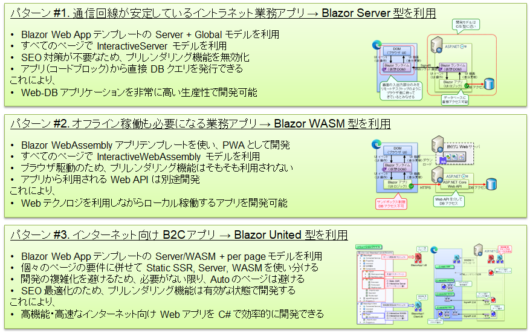
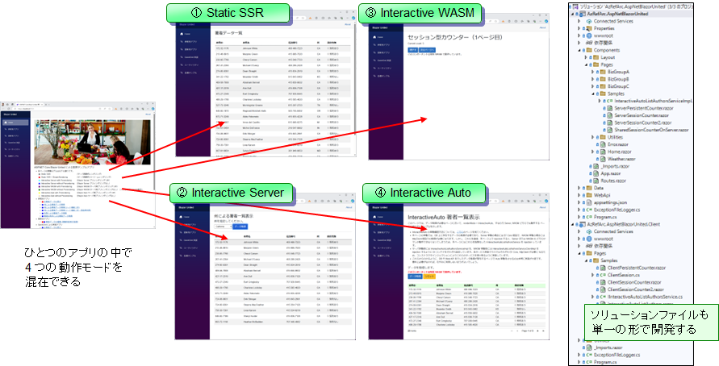
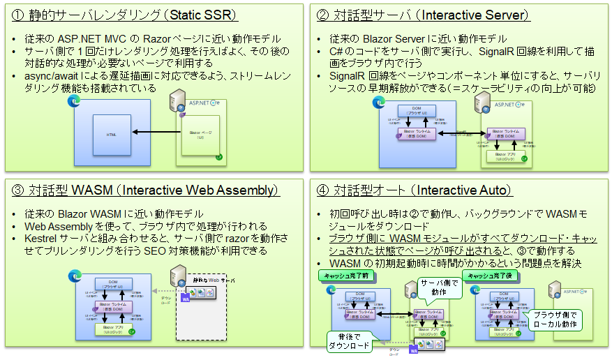
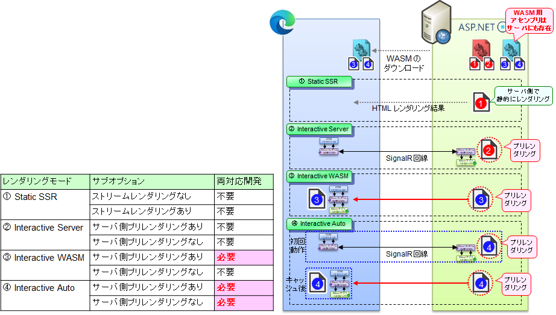
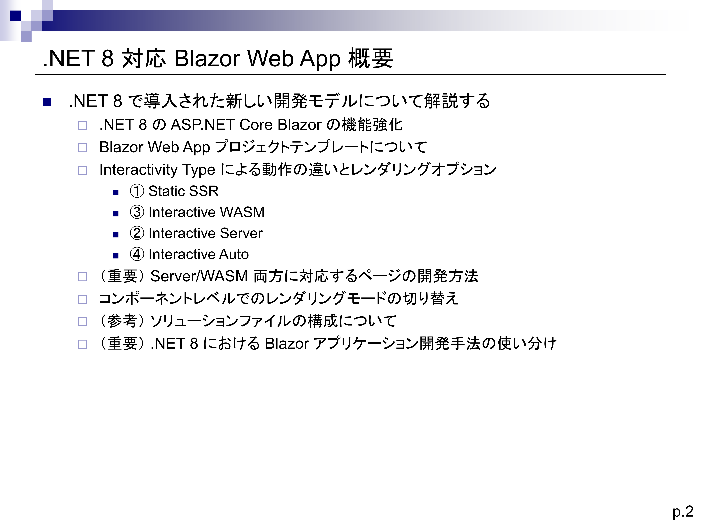
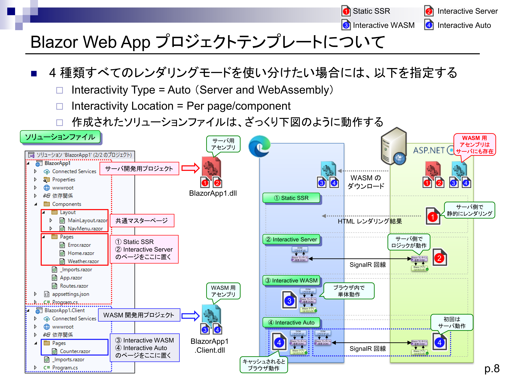
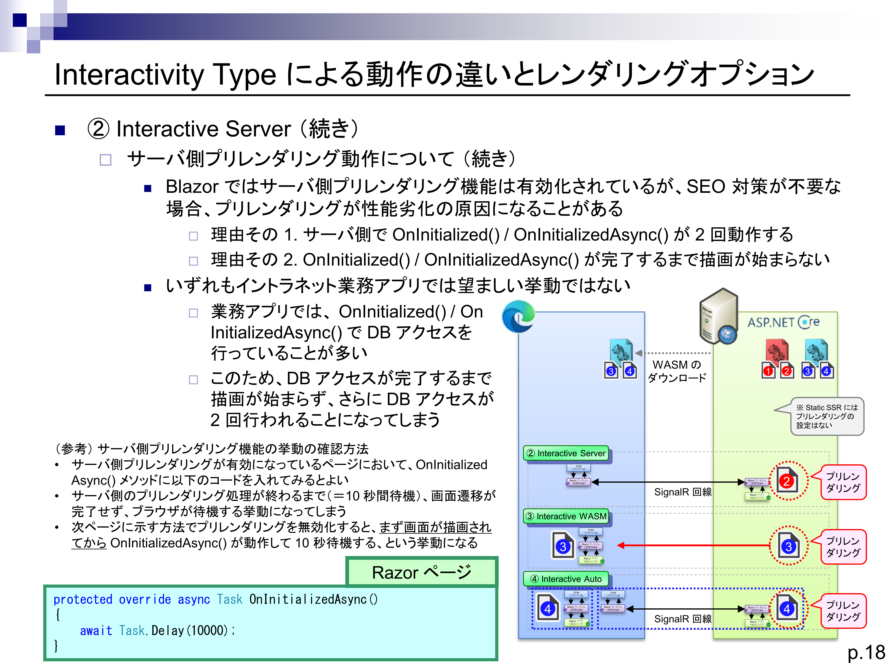
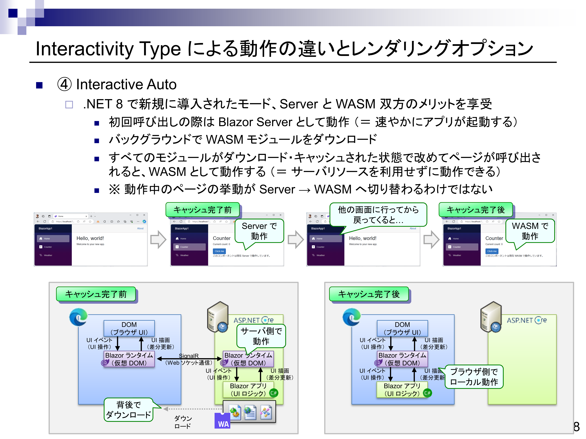
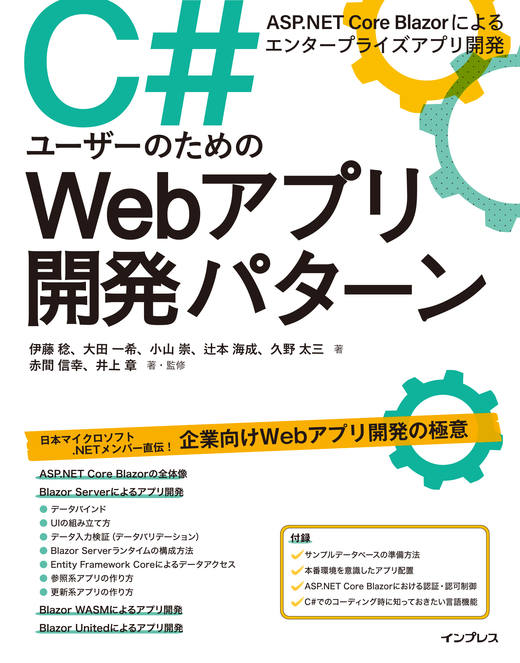

# AzRefArc.AspNetBlazorUnited

本サンプルは、.NET 8 対応の Blazor アプリケーションの開発方法を示したものです。主に、Web-DB 型の業務アプリを開発するケースを想定しています。

## .NET 8 における Blazor アプリの開発スタイルについて

.NET 8 では ASP.NET Core Blazor は大きく進化し、Server モデルと WASM モデルが一つに統合され、単一のアプリの中で両方のモデルが扱えるようになったことに加え、さらにサーバ側静的レンダリングや、Server/WASM モードを自動切換えする Auto モードも搭載され、都合 4 つのレンダリングモードが利用できるようになりました。これにより、ASP.NET Core Blazor は単一のアプリ開発技術で、イントラネット業務アプリからインターネットの大規模 B2C Web アプリ開発まで広範な開発対象をカバーすることが可能になりました。しかし、例えばシンプルなイントラネット業務アプリであればモードを絞って開発した方がよい場合もあります。このため、以下の 3 つの異なるサンプルを用意しています。利用シナリオに合わせて、適切なサンプルを選択してください。

※（注意）開発スタイル名はあくまで便宜的なもので、公式の呼び方があるわけではありませんが、わかりやすさのため、このように呼んでいます。特に 4 つのレンダリングモードを混在させて開発するスタイルをここでは "Blazor United 型" と呼んでいますが、公式ドキュメントではこの呼称は利用されていないのでご注意ください。

| 開発するアプリのタイプ | 開発スタイル | プロジェクトテンプレート | プロジェクトオプション | 利用するレンダリングモード | サンプルの置き場所 |
| --- | --- | --- | --- | --- | --- |
| イントラネット業務アプリ | Blazor Server 型 (従来型) | Blazor Web App | Interactivity Type = Server, Intaractivity Location = Global | InteractiveServer (prerender: false) | [Source](https://github.com/nakamacchi/AzRefArc.AspNetBlazorServer) [Web](https://azrefarc-aspnetblazorserver.azurewebsites.net/) |
| 随時切断型 Web アプリ | Blazor WASM 型 (従来型) | Blazor Web Assembly アプリ | (指定なし) | InteractiveWebAssembly (prerender: false) | [Source](https://github.com/nakamacchi/AzRefArc.AspNetBlazorWasm) [Web](https://azrefarc-aspnetblazorwasm.azurewebsites.net/) |
| インターネット B2C アプリ | Blazor United 型 (.NET 8) | Blazor Web App | Interactivity Type = Server and WebAssembly, Intaractivity Location = per page/component | Static SSR, InteractiveServer, WASM, Auto | [Source](https://github.com/nakamacchi/AzRefArc.AspNetBlazorUnited) [Web](https://azrefarc-aspnetblazorunited.azurewebsites.net/) |

  

## 本サンプルで利用するサンプル DB について

本サンプルでは SQL Server 2000 時代に利用されていた pubs データベースをサンプル DB として利用します。サンプルデータベースの準備方法は[こちら](https://github.com/nakamacchi/AzRefArc.SqlDb)のページに示してあります。4 通りの方法がありますので、いずれかの方法で準備してください。

また、サンプルを動作させる場合には、ユーザシークレットを用いて DB 接続文字列を設定してください。

```usersecrets.json
{
  "ConnectionStrings": {
    "PubsDbContext": "Server=tcp:xxxxx.database.windows.net,1433;Initial Catalog=pubs;Persist Security Info=False;User ID=xxxxx;Password=xxxxx;MultipleActiveResultSets=False;Encrypt=True;TrustServerCertificate=False;Connection Timeout=30;"
  }
}
```

## 本サンプルの特徴

本サンプルは Blazor United 型のアプリです。以下に示すように、4 通りのレンダリングモードを一つのアプリの中に混在させて利用しています。

  

それぞれのレンダリングモードの概要は以下の通りです。

  

各レンダリングモードと付随するオプション、Blazor ページの稼働場所については下記を参考にしてください。プリレンダリング機能を有効にした場合には、WASM, Auto モジュールがサーバ側でも動作する、という点に注意してください。

  

## 解説資料について

.NET 8 の Blazor United 型開発については、下記に解説資料を用意しています。.NET 7 からの差分情報になっておりますので、以前の Blazor をご存じの方はこちらの資料をご確認いただけると、内部の仕組みをよく理解できると思います。

[pptはこちらからご覧ください。](https://livesend.microsoft.com/i/KiIa1FQzy1DUXI8U0n7t8Mk08Fb9jKY3D9OXIRgzmtw6G7iQYzLWpOMJ73X83AsFe8xQ9m___p6KsoaTXzCvWmUKhaaBLjx7tbCEaYkaErl2eu3UYSU5cPepZ3Sn6lg9TJ)






## ASP.NET Core Blazor に関する学習書籍

ASP.NET Core Blazor を学習したい方は、以下の書籍をご活用ください。日本マイクロソフトの .NET メンバーにより書かれた書籍で、業務 Web アプリ開発に必要な知識を基礎から一通り学習することができます。

- [C#ユーザーのためのWebアプリ開発パターン　ASP.NET Core Blazorによるエンタープライズアプリ開発](https://book.impress.co.jp/books/1122101173)
- なお、新卒向けの入門的な書籍ではなく、経験年数 5～10 年以上の方を想定して書かれた実践的な書籍であるため、C# や Web 開発一般に関する説明は必ずしも十分ではありません。読んでみて知識が不足していると感じられた場合は、他の一般的な技術解説書も併用していただけるとよいかと思います。逆に、Java などの他言語で Web 開発に慣れた方であれば、（細かいコードはともかく）アーキテクチャ的な要点などを短時間でつかんでいただけると思います。

[](https://book.impress.co.jp/books/1122101173)

## 本番環境での稼働について

ASP.NET Core Blazor のアプリを、本番環境のようなクラスタリングされた環境下で稼働させる場合には、暗号処理に利用する鍵情報をすべてのサーバ間で揃えることが必要になります([詳細](https://learn.microsoft.com/ja-jp/aspnet/core/security/data-protection/configuration/overview?view=aspnetcore-8.0))。いくつかの方法がありますが、本サンプルでは以下のような実装を組み込んであります。

- アプリケーション設定に DataProtection:UseSharedKeyOnDatabase（環境変数の場合は DataProtection__UseSharedKeyOnDatabase）に true が設定されている場合には、鍵情報を DB により共有する。
- 個別に DB を用意するには大変なため、pubs データベース上に鍵を保存するテーブルを作成して利用する。
  - 本機能を利用する場合には、対象データベース上で以下のクエリを実行し、鍵を保存するテーブルを作成しておく
  - CREATE TABLE [dbo].[DataProtectionKeys] ( [ID][int] IDENTITY(1, 1) NOT NULL PRIMARY KEY, [FriendlyName] [varchar] (64) NULL, [Xml][text] NULL)
  - これにより、鍵情報がこのテーブルに保存され、クラスタリングされたサーバ間で共有されるようになる。
- 上記処理を行うために、アプリケーションに以下を加えている。
  - DataProtectionKeyDbContext.cs ファイルの追加
  - Microsoft.AspNetCore.DataProtection.EntityFrameworkCore パッケージの追加
  - Program.cs ファイルへの条件分岐コードの追加（下記）

```C#
string? useSharedKeyOnDatabase = builder.Configuration["DataProtection:UseSharedKeyOnDatabase"];
if (string.IsNullOrEmpty(useSharedKeyOnDatabase) == false && bool.Parse(useSharedKeyOnDatabase))
{
    builder.Services.AddDbContextFactory<DataProtectionKeyDbContext>(opt =>
    {
        // DbContext 構成設定
        // https://docs.microsoft.com/ja-jp/ef/core/dbcontext-configuration/#other-dbcontext-configuration
        if (builder.Environment.IsDevelopment())
        {
            opt = opt.EnableSensitiveDataLogging().EnableDetailedErrors();
        }
        opt.UseSqlServer(
            builder.Configuration.GetConnectionString("PubsDbContext"),
            providerOptions =>
            {
                providerOptions.EnableRetryOnFailure();
            });
    });
    builder.Services.AddDataProtection().PersistKeysToDbContext<DataProtectionKeyDbContext>();
}

```

なお本サンプルでは取り扱いを用意にするために DB 上に鍵を保存しましたが、実際の環境では KeyVault などで共有する方法もあります。詳細はドキュメントを参照してください。
